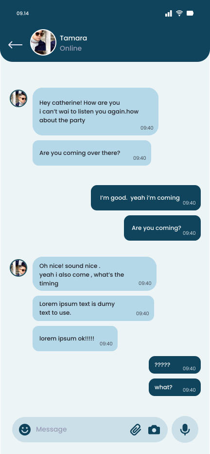
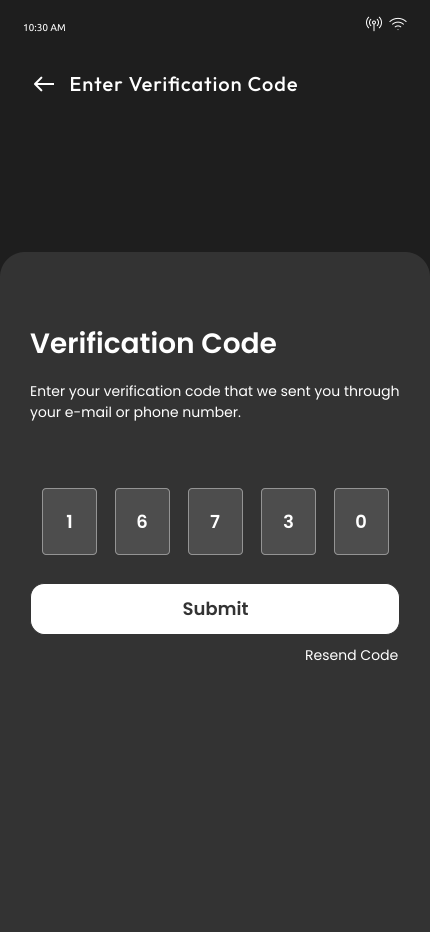
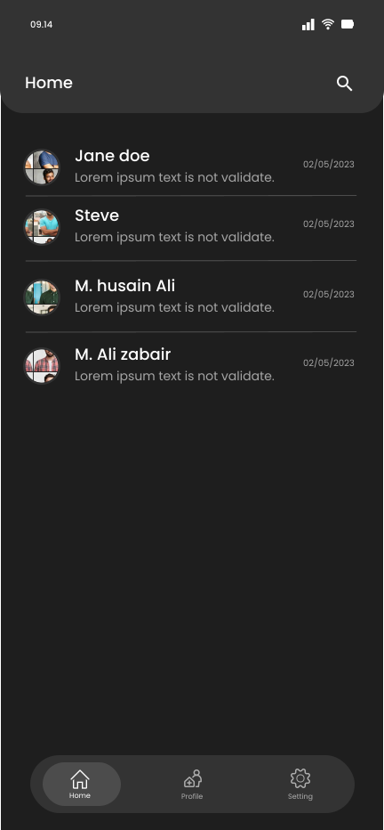

# Talkie
React-Native ChatApp

## Screenshots

### 1. Login Screen  

<p align="center">
  
  
</p>  

### 2. Home Screen and Chat Screen  

<p align="center">
  
  
</p>  

### Dark Mode  

<p align="center">
  
  
</p>  

<p align="center">
  
  
</p>  


## Technologies Used

This project was built using the following technologies:

- [React Native](https://reactnative.dev/): A framework for building native apps using React.
- [Firebase](https://firebase.google.com/): Used for real-time database, messaging, and push notifications.
- [Redux-Saga](https://redux-saga.js.org/): A library to manage side effects in Redux applications.
- [redux-persist](https://github.com/rt2zz/redux-persist): To persist the Redux state across app restarts.
- [AsyncStorage](https://github.com/react-native-async-storage/async-storage): Storage solution for persisting data locally in React Native apps.

## Usage

Follow these steps to clone and run the project:

1. **Clone the Repository:**
   ```bash
   git clone https://github.com/anas-developer01/Talkie

   cd ConnectVibe


2. **Ensure Node.js is installed:**
   ```bash
   node -v  # Ensure the output is v16.x.x

3. **Install Dependencies:**

You can install dependencies using either Yarn or npm:

- **Using Yarn:**

    ```bash
    yarn install
    ```

- **Using npm:**

    ```bash
    npm install
    ```

### Running the Project

After installing the dependencies, you can run the project on both Android and iOS:

- **For Android:**

    ```bash
    npx react-native run-android
    ```

- **For iOS (macOS only):**

    ```bash
    npx react-native run-ios
    ```

This will launch the app on your emulator or connected device for the respective platform.


